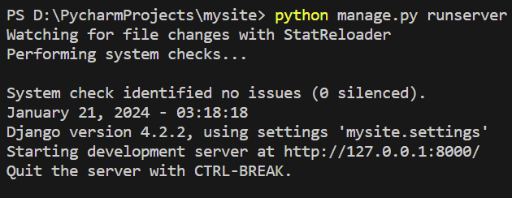
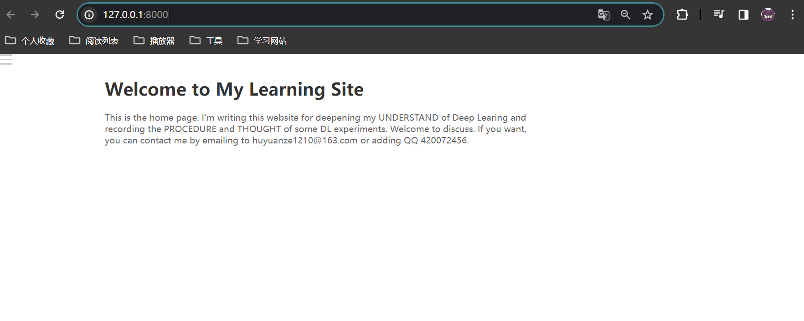
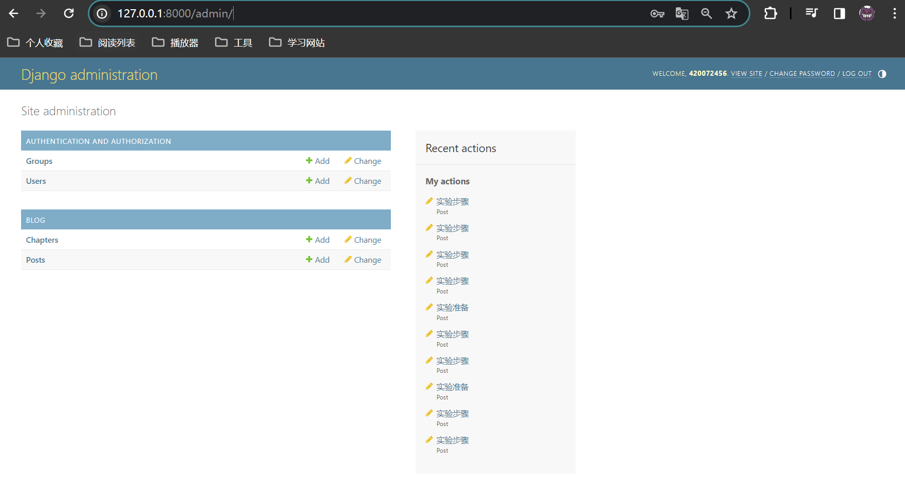

# 会写Markdown就行。

下载django就行。

python manage.py makemigrations

python manage.py migrate

python manage.py runserver能够启动服务器。

​	进入之后就是这样

在网址后输入/admin进入管理员页面。

点击+Add就是增加对应的文章或者章节。Chapter是一个大的章节。Post是每个章节里面的文章。可以自己研究一下。

# !!!!如果遇到打开网页之后按左上角菜单后，没有内容，那再说。。。那是数据库的问题先熟悉如何使用这个框架发布文章。。。
# 拉取远程代码仓库（github上面的）
git pull origin main
# 上传本地代码仓库（自己电脑上的）
git push origin main

拉取项目到本地，想要上传到远程仓库
git add .
git commit -m "增加了什么文章"
git push origin main
